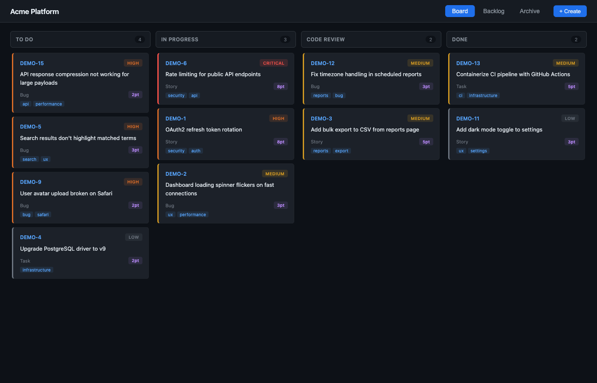
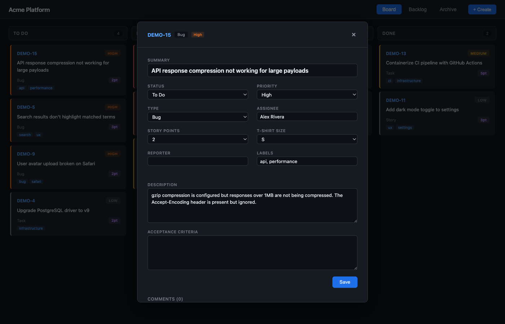
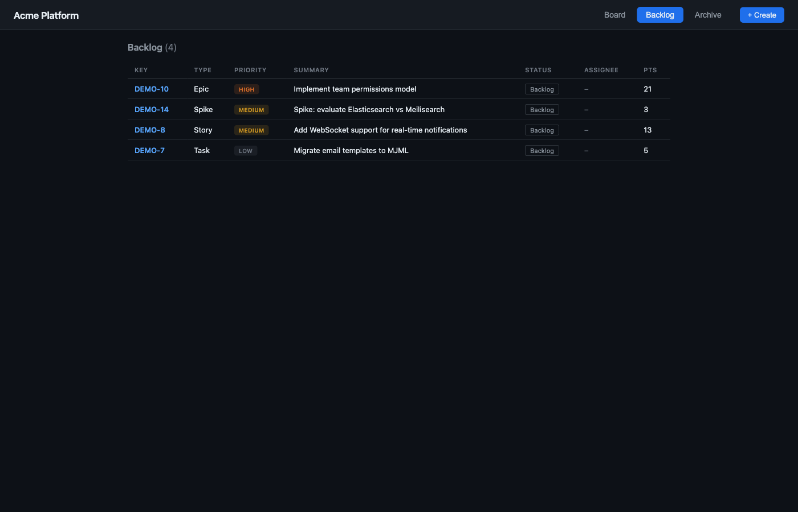

# Trellis

Local-first project boards backed by flat files.

Trellis is a lightweight, self-hosted alternative to Jira that runs entirely on your machine. It stores everything as JSON files in a `.trellis/` directory alongside your project — no database, no cloud, no account required.

Manage tickets from the CLI or through a web-based Kanban board.



## Features

- **Flat-file storage** — one JSON file per ticket, stored in `.trellis/` next to your code
- **CLI and web UI** — manage tickets from the terminal or a local Kanban board
- **Configurable columns** — define your own workflow stages per project
- **Three-zone lifecycle** — Backlog → Board → Archive
- **Drag-and-drop** — move tickets between columns on the board
- **Inline editing** — click any ticket to edit all fields directly in the web UI
- **Multi-project boards** — serve multiple projects with a single command and switch between them
- **Story points and t-shirt sizing** — track estimation however your team prefers
- **Comments** — threaded discussion on each ticket
- **Sprints** — group tickets into time-boxed iterations
- **Labels** — tag and filter tickets by category
- **JSON export** — pipe board data into other tools and dashboards
- **No migrations** — new fields automatically get sensible defaults on old tickets
- **Git-friendly** — track tickets alongside code, or `.gitignore` them
- **Zero dependencies at runtime** — no database, no Docker, no background services

## Quick Start

```bash
# Install globally
npm install -g trellis-pm

# Initialize in your project directory
cd my-project
trellis init MYAPP --name "My Application"

# Create some tickets
trellis ticket create -s "Fix login redirect loop" -t Bug -p High -a sarah
trellis ticket create -s "Add dark mode toggle" -t Story --points 5 --size M
trellis ticket create -s "Upgrade auth library" -t Task -p Low --status backlog

# View your tickets
trellis ticket list

# Open the board in your browser
trellis board
```

## Screenshots

### Kanban Board

Drag-and-drop tickets between columns. Each column maps to a status in your config. Priority is indicated by the coloured left border (red = Critical/High, yellow = Medium, grey = Low) and a badge.


### Ticket Detail

Click any ticket to edit it inline. All fields — summary, status, type, priority, assignee, points, size, description, acceptance criteria, labels — are editable. Comments can be added and deleted from the same view.



### Backlog

A table view of tickets that haven't entered the active workflow yet. These sit in columns marked `isBacklog: true` in your config and stay out of the board until promoted.



## CLI Reference

### Project Initialization

```bash
trellis init <KEY> [--name "Project Name"]
```

Creates a `.trellis/` directory in the current folder with default board columns, field options, and a ticket counter. The key becomes the prefix for all ticket IDs (e.g. `MYAPP-1`, `MYAPP-2`).

```bash
$ trellis init ACME --name "Acme Platform"
✓ Trellis project "ACME" initialized
  Data stored in /Users/you/projects/acme/.trellis
```

### Tickets

#### Create

```bash
trellis ticket create -s "Summary" [options]
```

| Flag | Description | Default |
|------|-------------|---------|
| `-s, --summary` | Ticket summary (required) | — |
| `-t, --type` | Bug, Task, Story, Epic, Spike | Task |
| `-p, --priority` | Critical, High, Medium, Low | Medium |
| `-a, --assignee` | Person assigned | — |
| `-r, --reporter` | Person who filed it | — |
| `--status` | Initial column ID | backlog |
| `--points` | Story points (1, 2, 3, 5, 8, 13, 21) | — |
| `--size` | T-shirt size (XS, S, M, L, XL) | — |
| `--ac` | Acceptance criteria | — |
| `--description` | Full description | — |
| `--labels` | Comma-separated labels | — |
| `--sprint` | Sprint ID | — |

New tickets land in the backlog by default. Use `--status todo` to place them directly on the board.

```bash
# A high-priority bug assigned to sarah, straight to the board
$ trellis ticket create -s "Payment form crashes on submit" -t Bug -p Critical -a sarah --status todo

# A story with estimation, sitting in the backlog
$ trellis ticket create -s "User profile page redesign" -t Story --points 8 --size L --labels "ux,frontend"

# A spike with acceptance criteria
$ trellis ticket create -s "Evaluate Redis vs Memcached" -t Spike --points 3 \
  --ac "Written comparison with latency benchmarks and ops complexity assessment"
```

#### List and Filter

```bash
trellis ticket list [filters]
```

Filter by any combination of status, assignee, type, priority, sprint, or label:

```bash
# All tickets
$ trellis ticket list

# Only bugs
$ trellis ticket list --type Bug

# High-priority items assigned to sarah
$ trellis ticket list --priority High --assignee sarah

# Everything in the current sprint
$ trellis ticket list --sprint sprint-3

# Filter by label
$ trellis ticket list --label frontend
```

#### Show Detail

```bash
$ trellis ticket show ACME-7

ACME-7  Critical
Payment form crashes on submit

  Type:       Bug
  Status:     todo
  Assignee:   sarah
  Points:     5
  Labels:     payments, frontend
  Created:    2026-03-10T14:23:00.000Z
  Updated:    2026-03-10T15:01:00.000Z

  Description:
  Submitting the payment form with a valid card throws an unhandled
  promise rejection. Reproduced in Chrome and Firefox.

  Acceptance Criteria:
  Form submits without error. Payment confirmation screen shown.
```

#### Update

```bash
# Change priority and add points
$ trellis ticket update ACME-7 --priority Critical --points 5

# Reassign and add labels
$ trellis ticket update ACME-7 --assignee jake --labels "payments,frontend"
```

#### Move

Shorthand for changing status:

```bash
# Move to in-progress
$ trellis ticket move ACME-7 in-progress
✓ ACME-7 → In Progress

# Move to code review
$ trellis ticket move ACME-7 review
✓ ACME-7 → Code Review
```

Status values are the column `id` from your config (e.g. `todo`, `in-progress`, `review`, `done`).

#### Archive

Move completed tickets out of the board and into the archive:

```bash
$ trellis ticket archive ACME-7
✓ ACME-7 → Archived
```

Archived tickets are still stored and visible in the Archive tab of the web UI. They no longer appear on the board or backlog.

#### Delete

```bash
$ trellis ticket delete ACME-7
Delete ACME-7? (y/N) y
✓ Deleted ACME-7

# Skip confirmation
$ trellis ticket delete ACME-7 -f
```

#### JSON Output

All ticket commands support `--json` for machine-readable output:

```bash
$ trellis ticket show ACME-7 --json
{
  "key": "ACME-7",
  "summary": "Payment form crashes on submit",
  "type": "Bug",
  "status": "in-progress",
  "priority": "Critical",
  ...
}

$ trellis ticket list --status todo --json | jq '.[].key'
"ACME-4"
"ACME-9"
"ACME-15"
```

### Comments

```bash
# Add a comment
$ trellis comment add ACME-7 -b "Reproduced on staging. Stack trace attached." -a sarah

# List comments
$ trellis comment list ACME-7

# Delete a comment (by ID)
$ trellis comment delete ACME-7 <comment-id>
```

### Sprints

```bash
# Create a sprint
$ trellis sprint create --name "Sprint 3" --start 2026-03-10 --end 2026-03-24

# List sprints
$ trellis sprint list

# Add tickets to a sprint
$ trellis sprint add sprint-3 ACME-7
$ trellis sprint add sprint-3 ACME-12

# Remove a ticket from a sprint
$ trellis sprint remove sprint-3 ACME-12
```

### Board

```bash
# Open the board for the current project
trellis board

# Specify a port
trellis board --port 3000

# Don't auto-open the browser
trellis board --no-open

# Serve multiple projects with a project switcher
trellis board ./project-a ./project-b ./project-c
```

Starts a local web server and opens the Kanban board in your browser. When multiple paths are given, a segmented project switcher appears in the header — each project keeps its own config, columns, and tickets.

### Data Export

Export board data as JSON for use in other tools, dashboards, or scripts:

```bash
# Full board data (config + tickets + sprints)
$ trellis data

# Just tickets or config
$ trellis data --tickets-only
$ trellis data --config-only

# Filter exported tickets
$ trellis data --status in-progress
$ trellis data --sprint sprint-3

# Compact output (no sprints)
$ trellis data --compact

# Export from a different project directory
$ trellis data --path /path/to/other/project

# Export multiple projects at once
$ trellis data --path ./project-a ./project-b
```

Pipe it into `jq` for quick queries:

```bash
# Count open bugs
$ trellis data --tickets-only | jq '[.[] | select(.type == "Bug" and .status != "done")] | length'

# List all assignees
$ trellis data --tickets-only | jq '[.[].assignee | select(. != "")] | unique'
```

### Configuration

```bash
# View full config
$ trellis config get

# View a specific value (dot notation)
$ trellis config get board.columns
$ trellis config get fields.priorities

# Set a value
$ trellis config set server.port 3000
```

## Web UI

The web UI has three views, accessible via the segmented control in the header:

- **Board** — Kanban columns with drag-and-drop. Columns are driven by your project config, not hardcoded. Cards show ticket key, summary, type, priority badge, story points, and labels.
- **Backlog** — Table view of tickets in columns marked `isBacklog: true`. Only tickets explicitly in a backlog status appear here — board tickets stay on the board.
- **Archive** — Table view of completed tickets moved to columns marked `isArchive: true`. Keeps finished work accessible without cluttering the board.

Click any ticket to open its detail modal and edit all fields inline. Hit Save to persist changes. Add and delete comments from the same view. Create new tickets from the + Create button in the header.

## Ticket Lifecycle

Tickets flow through three zones:

```
Backlog  →  Board  →  Archive
```

1. **Backlog** — Ideas, future work, and unprioritised items. Tickets created without a `--status` flag land here by default.
2. **Board** — Active work. Move tickets across your custom columns (To Do → In Progress → Code Review → Done, or whatever your workflow looks like).
3. **Archive** — Completed and closed tickets. Run `trellis ticket archive <KEY>` or drag to the archive column in the web UI.

## Data Storage

Everything lives in `.trellis/` inside your project directory:

```
your-project/
  .trellis/
    config.json          # Board columns, field options, server settings
    counter.json         # Auto-incrementing ticket number
    tickets/
      MYAPP-1.json       # One file per ticket
      MYAPP-2.json
      MYAPP-3.json
    sprints/
      sprint-1.json
```

### Ticket File Format

Each ticket is a standalone JSON file:

```json
{
  "key": "MYAPP-1",
  "summary": "Fix login redirect loop",
  "description": "After OAuth callback, the app redirects back to /login instead of /dashboard.",
  "type": "Bug",
  "status": "in-progress",
  "priority": "High",
  "assignee": "sarah",
  "reporter": "jake",
  "points": 3,
  "tshirtSize": "S",
  "acceptanceCriteria": "Login redirects to /dashboard. No redirect loops in any browser.",
  "labels": ["auth", "urgent"],
  "sprint": "sprint-3",
  "comments": [
    {
      "id": "abc123",
      "author": "jake",
      "body": "Reproduced on staging — happens with Google OAuth only.",
      "created": "2026-03-10T14:30:00.000Z"
    }
  ],
  "created": "2026-03-10T14:00:00.000Z",
  "updated": "2026-03-10T16:45:00.000Z"
}
```

This flat-file approach means:

- **No migrations** — adding new fields to Trellis automatically gives old tickets sensible defaults via spread-merge
- **Git-friendly** — commit tickets alongside your code, review changes in PRs, or `.gitignore` them
- **No merge conflicts** — one file per ticket means parallel edits on different tickets never conflict
- **Portable** — copy the `.trellis/` folder to move your board anywhere

## Board Configuration

Columns are fully configurable per project. Edit `.trellis/config.json` directly or use the CLI:

```json
{
  "board": {
    "columns": [
      { "id": "backlog", "name": "Backlog", "isBacklog": true },
      { "id": "todo", "name": "To Do" },
      { "id": "in-progress", "name": "In Progress" },
      { "id": "review", "name": "Code Review" },
      { "id": "qa", "name": "QA" },
      { "id": "done", "name": "Done", "isDone": true },
      { "id": "archived", "name": "Archived", "isArchive": true }
    ]
  }
}
```

### Column Flags

| Flag | Effect |
|------|--------|
| `isBacklog` | Ticket appears in the Backlog tab, not on the board |
| `isDone` | Marks the column as a completion state |
| `isArchive` | Ticket appears in the Archive tab, not on the board |

You can have as many or as few board columns as you like. A minimal setup might be just `To Do` and `Done`. A more detailed one might separate development, review, QA, and staging.

### Field Options

The config also controls what appears in dropdowns:

```json
{
  "fields": {
    "types": ["Bug", "Task", "Story", "Epic", "Spike"],
    "priorities": ["Critical", "High", "Medium", "Low"],
    "tshirtSizes": ["XS", "S", "M", "L", "XL"],
    "pointScale": [1, 2, 3, 5, 8, 13, 21]
  }
}
```

Customise these per project — add your own types, change the point scale, or remove t-shirt sizing entirely.

## Integrations

### Piping Data to Other Tools

The `trellis data` command outputs structured JSON, making it easy to integrate with other systems:

```bash
# Feed into a dashboard
$ trellis data --compact | curl -X POST -H "Content-Type: application/json" -d @- https://dashboard.internal/api/boards

# Generate a status report
$ trellis data --tickets-only | jq -r '.[] | select(.status != "backlog" and .status != "archived") | "\(.key)\t\(.status)\t\(.summary)"'

# Count points per status
$ trellis data --tickets-only | jq 'group_by(.status) | map({status: .[0].status, points: [.[].points // 0] | add})'
```

### Multi-Project Dashboards

Serve all your projects from one board:

```bash
$ trellis board ~/projects/frontend ~/projects/backend ~/projects/mobile
✓ Trellis serving 3 project(s) at http://localhost:4000
  → ~/projects/frontend
  → ~/projects/backend
  → ~/projects/mobile
```

Each project maintains its own columns, tickets, and configuration. A segmented control in the header switches between them.

### Git Integration

Track your tickets in the same repo as your code:

```bash
# Tickets are just JSON files — commit them like anything else
$ git add .trellis/
$ git commit -m "Add auth tickets for sprint 3"
```

Or keep them out of version control:

```bash
# .gitignore
.trellis/
```

## Aliases

The CLI is available as both `trellis` and `trl`. Subcommands have short aliases too:

| Command | Alias |
|---------|-------|
| `trellis ticket` | `trl t` |
| `trellis ticket create` | `trl t c` |
| `trellis ticket list` | `trl t ls` |
| `trellis ticket show` | `trl t show` |
| `trellis ticket update` | `trl t u` |
| `trellis ticket move` | `trl t mv` |
| `trellis ticket delete` | `trl t rm` |
| `trellis comment` | `trl c` |
| `trellis sprint` | `trl s` |
| `trellis board` | `trl b` |
| `trellis data` | `trl d` |

## Requirements

- Node.js 18+
- npm

## License

MIT
